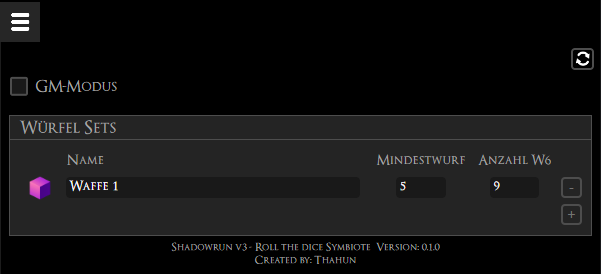
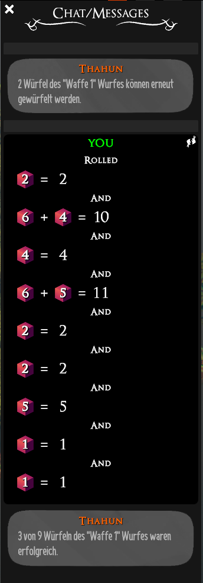

# Introduction
This symbiote enables you to easier roll dices for Shadowrun v3, providing you the ones to reroll and telling you how many dices got above the defined threshold.

## Add dice sets
The symbiote enables you to define dice sets, which are persisted and by that can be used across sessions and boards.

## Roll the dices
By clicking the dice icon of a set, the dices are automatically put into tray. After throwing them, the ones with a 6 are automatically put again to the tray. \
When no dices can be rerolled anymore, the results are shown to you and a message tells you how many dices got above the threshold. So how many successful rolles you have.

### GM Mode
If you're allowed to be a GM at the board, you're getting the option to hide your results. \
You can still see them in the chat, but other players can't.

_Hint: Don't forget to throw the dices hidden, this only hides the result messages_

 \
_Example: Dice sets_

 \
_Example: Messages & Log_
